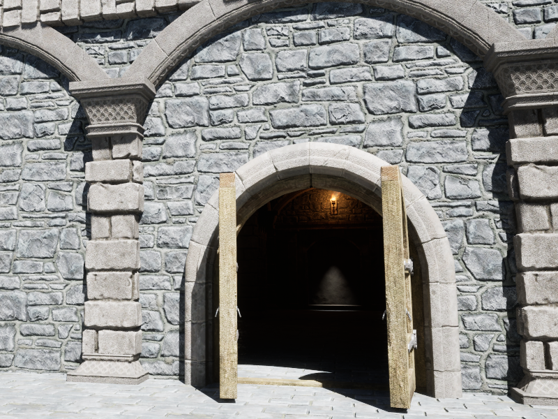
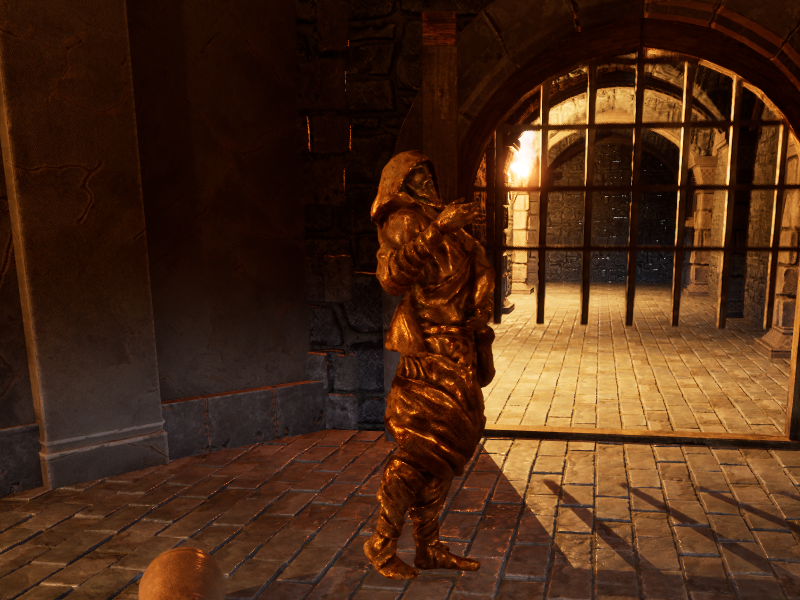
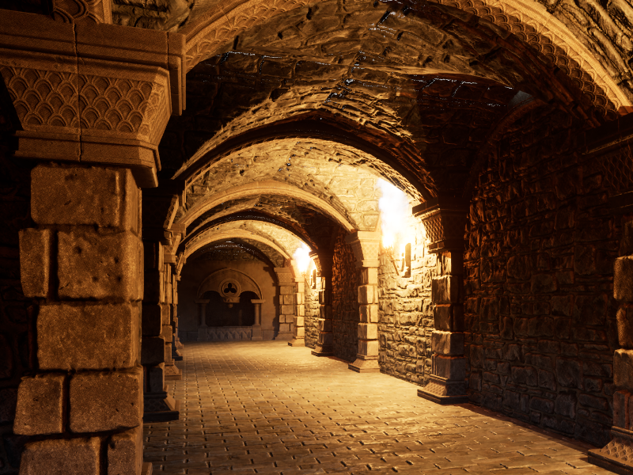
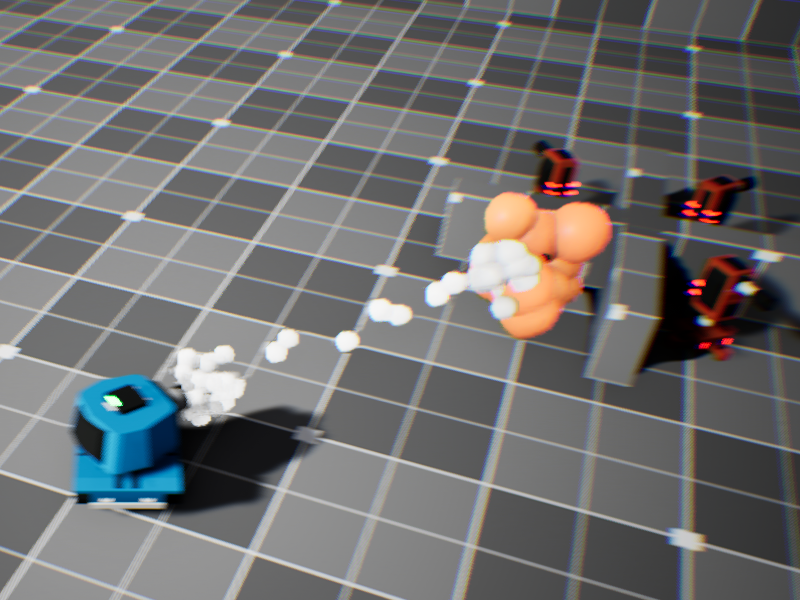

> [!NOTE]
> All projects were made with UE 5.3
> 
> All source codes are from a lecture in udemy, <Unreal Engine 5 C++ Developer: Learn C++ & Make Video Games>.
# CryptRaider
- Firstperson Adventure/Puzzle
- Explore medieval dungeon and solve hidden puzzles!

</img>
</img>

## Features
### Grab

- UPhysicsHandleComponent
  - 물체를 잡기 위한 컴포넌트 클래스
  - SetTargetLocation()으로 대상 물체의 위치와 회전값을 실시간으로 조정합니다.
```cpp
UPhysicsHandleComponent *PhysicsHandle = GetPhysicsHandle();
PhysicsHandle->GrabComponentAtLocationWithRotation(
    HitComponent,
    NAME_None,
    HitResult.ImpactPoint,
    HitResult.GetComponent()->GetComponentRotation()
);
```

- UPrimitiveComponent
  - USceneComponent의 하위 클래스로 기하학적 형태를 가질 수 있고 충돌 처리가 가능한 컴포넌트입니다.
  - USceneComponent는 다른 컴포넌트에 부착될 수는 있지만 렌더링이나 충돌 처리가 불가능합니다.
  - AActor::GetRootComponent()의 반환값는 USceneComponent* 이므로 UPrimitiveComponent로 사용 시 Cast(dynamic cast)가 필요합니다.
```cpp
UPrimitiveComponent* Component = Cast<UPrimitiveComponent>(Target->GetRootComponent());
if (Component != nullptr)
{
    Component->SetSimulatePhysics(false);
}
Target->AttachToComponent(this, FAttachmentTransformRules::KeepWorldTransform);
```

- AActor::GetOverlappingActors()
  - overlap중인 모든 액터들을 TArray<Actor*> 형태로 반환합니다.
  - 충돌에는 ignore, overlap, block 총 세 가지 옵션이 있으며 이 중 overlap은 말 그대로 중첩상태를 말합니다.
```cpp
AActor *UTriggerComponent::GetAcceptableActor() const
{
    TArray<AActor *> Actors;
    GetOverlappingActors(Actors);

    for (auto &actor : Actors)
    {
        bool HasAcceptableTag = actor->ActorHasTag(UnlockTag);
        bool IsGrabbed = actor->ActorHasTag("Grabbed");
        if (HasAcceptableTag && !IsGrabbed)
        {
            return actor;
        }
    }

    return nullptr;
}
```

### Moving Object
- FMath::VInterpConstantTo()
  - static 함수이며 두 벡터를 고정된 값으로 보간합니다. 주로 액터를 특정 틱만큼 이동시키기 위해 사용합니다.
```cpp
FVector NewLocation = FMath::VInterpConstantTo(CurrentLocation, TargetLocation, DeltaTime, Speed);
GetOwner()->SetActorLocation(NewLocation);
```

### Lighting
</img>
- Lumen을 통해 동적으로 광선을 추적하고 렌더링합니다.
- 횃불의 밝기는 약해졌다 강해지기를 반복합니다. 이를 통해 더 현실감 있는 던전을 묘사합니다.
- 완전한 외부 빛의 차단을 위해 던전 외부에 추가적인 벽 메시들을 배치했습니다.

# ToonTanks
- Thirdperson shooter
- Cartoon style graphic
- Avoid tower's attack and kill them all!

</img>

## Features
### Code-based hierarchy
- CreateDefaultSubobject()
  - 컴포넌트를 만들고 계층구조를 설계합니다.
  - SetupAttachment로 상위 컴포넌트에 부착합니다.
```cpp
// Sets default values
ABasePawn::ABasePawn()
{
 	// Set this pawn to call Tick() every frame.  You can turn this off to improve performance if you don't need it.
	PrimaryActorTick.bCanEverTick = true;

	CapsuleComp = CreateDefaultSubobject<UCapsuleComponent>(TEXT("Capsule Collider"));
	RootComponent = CapsuleComp;

	BaseMesh = CreateDefaultSubobject<UStaticMeshComponent>(TEXT("Base Mesh"));
	BaseMesh->SetupAttachment(CapsuleComp);

	TurretMesh = CreateDefaultSubobject<UStaticMeshComponent>(TEXT("Turret Mesh"));
	TurretMesh->SetupAttachment(BaseMesh);

	ProjectileSpawnPoint = CreateDefaultSubobject<USceneComponent>(TEXT("Projectile Spawn Point"));
	ProjectileSpawnPoint->SetupAttachment(TurretMesh);
}
```

### Input
- SetupPlayerInputComponent()
  - Input과 관련한 설정을 초기화합니다.
  - BeginPlay보다 먼저 실행됩니다.
  - BindAxis로 Axis Input으로 실행될 함수를 지정합니다.
```cpp
void ATank::SetupPlayerInputComponent(UInputComponent *PlayerInputComponent)
{
    Super::SetupPlayerInputComponent(PlayerInputComponent);

    PlayerInputComponent->BindAxis(TEXT("MoveForward"), this, &ATank::Move);
    PlayerInputComponent->BindAxis(TEXT("Turn"), this, &ATank::Turn);

    PlayerInputComponent->BindAction(TEXT("Fire"), IE_Pressed, this, &ATank::Fire);
}
```

### Pawn Control
- USceneComponent::SetWorldRotation()
  - 컴포넌트(주로 메시)의 월드 회전값을 조정합니다.
  - FRotator()로 벡터의 월드 회전값을 가져옵니다.
  - FMath::RInterpTo()로 회전값에 보간을 적용하여 부드럽게 움직이도록 구현합니다.
  - UGameplayStatistics::GetWorldDeltaSeconds()로 Tick범위 밖에서 DeltaSeconds 값을 받아올 수 있습니다.
```cpp
void ABasePawn::RotateTurret(FVector LookAtTarget)
{
	FVector ToTarget = LookAtTarget - TurretMesh->GetComponentLocation();
	FRotator LookAtRotation = FRotator(0.f, ToTarget.Rotation().Yaw, 0.f);
	TurretMesh->SetWorldRotation(
		FMath::RInterpTo(
			TurretMesh->GetComponentRotation(),
			LookAtRotation,
			UGameplayStatics::GetWorldDeltaSeconds(this),
			5.f)
	);
}
```

- APlayerController::GetHitResultUnderCursor()
  - 마우스 커서 위치로 Line Trace한 다음 결과를 가져옵니다.
```cpp
// Called every frame
void ATank::Tick(float DeltaTime)
{
	Super::Tick(DeltaTime);
	
    if (PlayerController != nullptr)
    {
        FHitResult HitResult;
        PlayerController->GetHitResultUnderCursor(
            ECollisionChannel::ECC_Visibility,
            false,
            HitResult);
        
        RotateTurret(HitResult.ImpactPoint);
    }
}
```

- AddActorLocalOffset() & AddActorLocalRotation()
  - 액터의 위치와 회전값을 Delta값 만큼 변경합니다.
```cpp
void ATank::Move(float Value)
{
    FVector DeltaLocation = FVector::ZeroVector;
    DeltaLocation.X = Value * Speed * UGameplayStatics::GetWorldDeltaSeconds(this);
    AddActorLocalOffset(DeltaLocation, true);
}

void ATank::Turn(float Value)
{
    FRotator DeltaRotaion = FRotator::ZeroRotator;
    DeltaRotaion.Yaw = Value * TurnRate * UGameplayStatics::GetWorldDeltaSeconds(this);
    AddActorLocalRotation(DeltaRotaion, true);
}
```

### Projectile
- UProjectileMovementComponent
  - UE의 physics와 별개로 작동하는 발사체 처리 컴포넌트
  - 일반적으로 회전값이 고정되어 있으며 목표지점을 향해 날아가게끔 하며 중력이 적용됩니다.
  - 발사체의 움직임과 관련한 다양한 옵션을 제공합니다.
```cpp
ProjectileMovement = CreateDefaultSubobject<UProjectileMovementComponent>(TEXT("Projectile Movement"));
ProjectileMovement->MaxSpeed = 2000.f;
ProjectileMovement->InitialSpeed = 1500.f;
```

- OnComponentHit
  - 컴포넌트의 충돌 시점의 콜백 함수를 호출하는 이벤트
  - AddDynamic()으로 콜백 함수의 정보를 넘겨줍니다.
  - Instigator는 이벤트에 등록된 콜백 함수들을 일괄 호출(Invoke)하는 객체입니다.
```cpp
// Called when the game starts or when spawned
void AProjectile::BeginPlay()
{
	Super::BeginPlay();
	
	ProjectileMesh->OnComponentHit.AddDynamic(this, &AProjectile::OnHit);
}

void AProjectile::OnHit(UPrimitiveComponent* HitComp, AActor* OtherActor, UPrimitiveComponent* OtherComp, FVector NormalImpulse, const FHitResult& Hit)
{
	AActor* MyOwner = GetOwner();
	if (MyOwner == nullptr)
	{
		Destroy();
		return;
	}

	AController* MyOwnerInstigator = MyOwner->GetInstigatorController();
	UClass* DamageTypeClass = UDamageType::StaticClass();

	if (OtherActor && OtherActor != this && OtherActor != MyOwner && MyOwnerInstigator)
	{
		UGameplayStatics::ApplyDamage(OtherActor, Damage, MyOwnerInstigator, this, DamageTypeClass);
	}
	Destroy();
}
```

### Effects
- UGameplayStatics::SpawnEmitterAtLocation()
  - UParticleSystem 객체를 지정된 위치에 소환합니다. 해당 위치에 파티클 효과가 나타납니다.
- UGameplayStatics::PlaySoundAtLocation()
  - USoundBase 객체를 지정된 위치에 소환합니다. 해당 위치로부터 소리가 재생되어 널리 퍼집니다.
- APlayerController::ClientStartCameraShake()
  - TSubclassOf<UCameraShakeBase> 객체에 저장된 값을 토대로 카메라의 움직임 효과를 실행합니다.
  - TSubclassOf로 에디터 상에서 지정가능한 클래스의 범위를 한정합니다.
  - UE 5.0 이하의 Matinee Camera Shake 클래스가 UE 5.1 이후에서는 Legacy Camera Shake로 변경되었습니다.
```cpp
void ABasePawn::HandleDestruction()
{
	if (ExplosionParticles)
	{
		UGameplayStatics::SpawnEmitterAtLocation(this, ExplosionParticles, GetActorLocation(), GetActorRotation());
	}
	if (DeathSound)
	{
		UGameplayStatics::PlaySoundAtLocation(this, DeathSound, GetActorLocation());
	}
	if (DeathCameraShakeClass)
	{
		GetWorld()->GetFirstPlayerController()->ClientStartCameraShake(DeathCameraShakeClass);
	}
}
```

> [!NOTE]
> 현재 계속 업데이트 중입니다.
