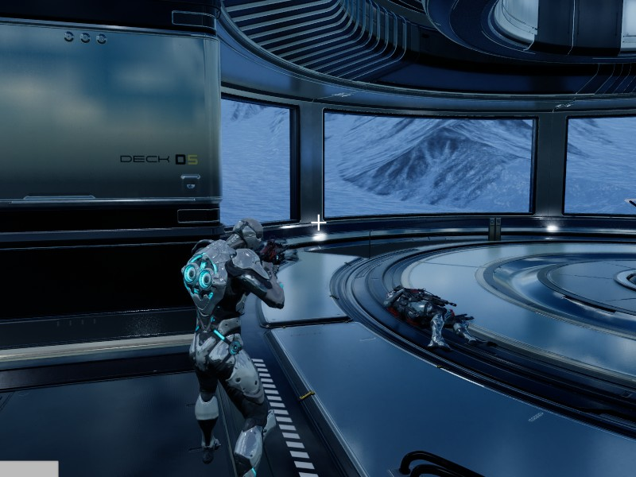
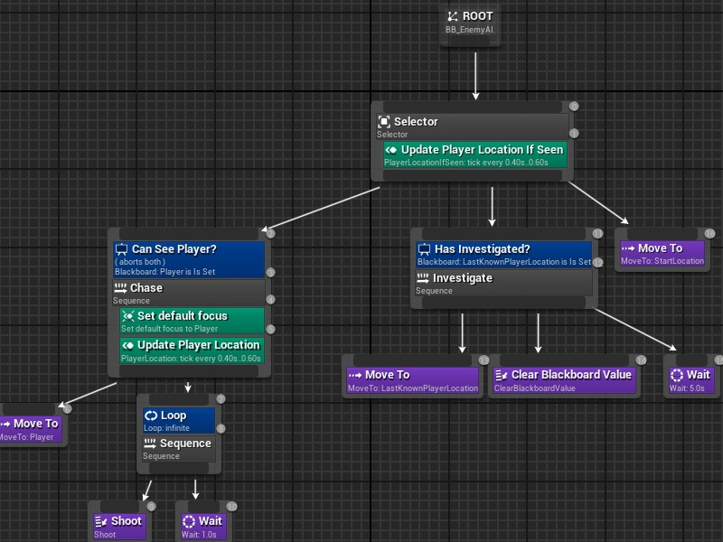
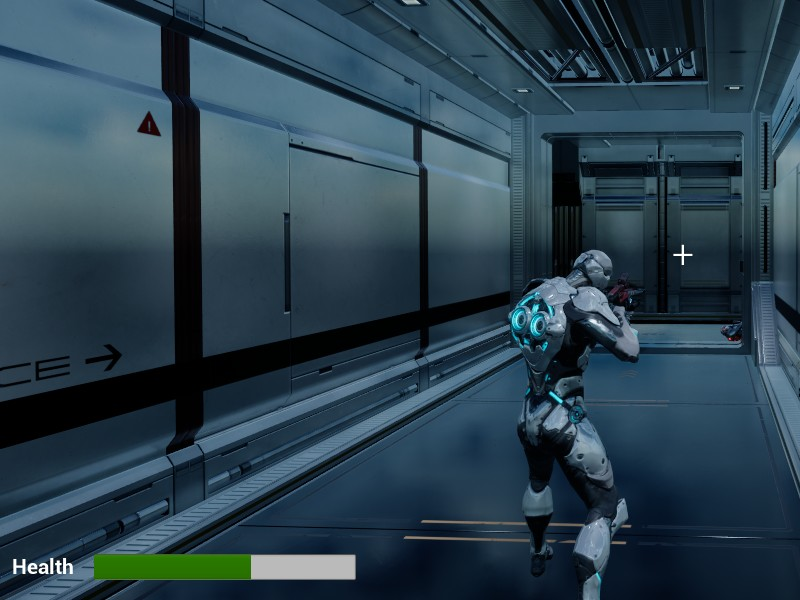
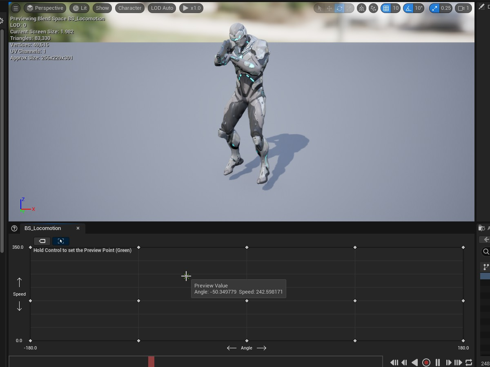
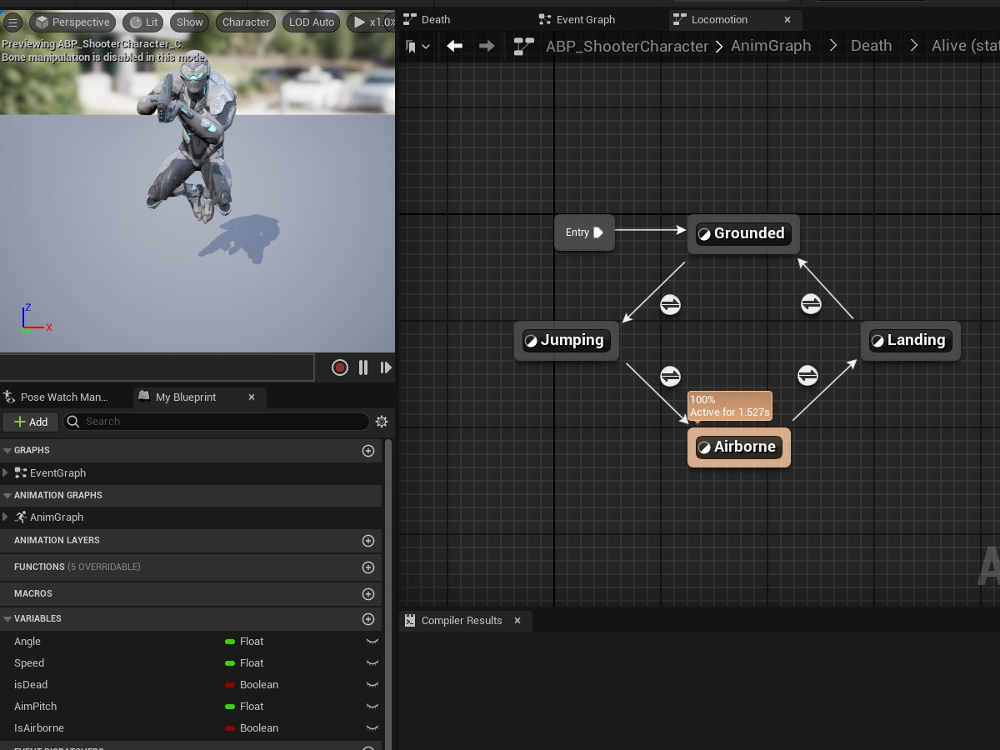

> [!NOTE]
> All projects were made with UE 5.3
> 
> All source codes are from a lecture in udemy, <Unreal Engine 5 C++ Developer: Learn C++ & Make Video Games>.
# CryptRaider
- Firstperson Adventure/Puzzle
- Explore medieval dungeon and solve hidden puzzles!

</img>
</img>

## Features
### Grab

- UPhysicsHandleComponent
  - 물체를 잡기 위한 컴포넌트 클래스
  - SetTargetLocation()으로 대상 물체의 위치와 회전값을 실시간으로 조정합니다.
```cpp
UPhysicsHandleComponent *PhysicsHandle = GetPhysicsHandle();
PhysicsHandle->GrabComponentAtLocationWithRotation(
    HitComponent,
    NAME_None,
    HitResult.ImpactPoint,
    HitResult.GetComponent()->GetComponentRotation()
);
```

- UPrimitiveComponent
  - USceneComponent의 하위 클래스로 기하학적 형태를 가질 수 있고 충돌 처리가 가능한 컴포넌트입니다.
  - USceneComponent는 다른 컴포넌트에 부착될 수는 있지만 렌더링이나 충돌 처리가 불가능합니다.
  - AActor::GetRootComponent()의 반환값은 USceneComponent* 이므로 UPrimitiveComponent로 사용 시 Cast(dynamic cast)가 필요합니다.
```cpp
UPrimitiveComponent* Component = Cast<UPrimitiveComponent>(Target->GetRootComponent());
if (Component != nullptr)
{
    Component->SetSimulatePhysics(false);
}
Target->AttachToComponent(this, FAttachmentTransformRules::KeepWorldTransform);
```

- AActor::GetOverlappingActors()
  - overlap중인 모든 액터들을 TArray 형태로 반환합니다.
  - 충돌에는 ignore, overlap, block 총 세 가지 옵션이 있으며 이 중 overlap은 말 그대로 중첩상태를 말합니다.
```cpp
AActor *UTriggerComponent::GetAcceptableActor() const
{
    TArray<AActor *> Actors;
    GetOverlappingActors(Actors);

    for (auto &actor : Actors)
    {
        bool HasAcceptableTag = actor->ActorHasTag(UnlockTag);
        bool IsGrabbed = actor->ActorHasTag("Grabbed");
        if (HasAcceptableTag && !IsGrabbed)
        {
            return actor;
        }
    }

    return nullptr;
}
```

### Moving Object
- FMath::VInterpConstantTo()
  - static 함수이며 두 벡터를 고정된 값으로 보간합니다. 주로 액터를 특정 틱만큼 이동시키기 위해 사용합니다.
```cpp
FVector NewLocation = FMath::VInterpConstantTo(CurrentLocation, TargetLocation, DeltaTime, Speed);
GetOwner()->SetActorLocation(NewLocation);
```

### Lighting
</img>
- Lumen을 통해 동적으로 광선을 추적하고 렌더링합니다.
- 횃불의 밝기는 약해졌다 강해지기를 반복합니다. 이를 통해 더 현실감 있는 던전을 묘사합니다.
- 완전한 외부 빛의 차단을 위해 던전 외부에 추가적인 벽 메시들을 배치했습니다.

# ToonTanks
- Quarter view shooting
- Cartoon style graphic
- Avoid tower's attack and kill them all!

</img>

## Features
### Code-based hierarchy
- CreateDefaultSubobject()
  - 컴포넌트를 만들고 계층구조를 설계합니다.
  - SetupAttachment로 상위 컴포넌트에 부착합니다.
```cpp
// Sets default values
ABasePawn::ABasePawn()
{
 	// Set this pawn to call Tick() every frame.  You can turn this off to improve performance if you don't need it.
	PrimaryActorTick.bCanEverTick = true;

	CapsuleComp = CreateDefaultSubobject<UCapsuleComponent>(TEXT("Capsule Collider"));
	RootComponent = CapsuleComp;

	BaseMesh = CreateDefaultSubobject<UStaticMeshComponent>(TEXT("Base Mesh"));
	BaseMesh->SetupAttachment(CapsuleComp);

	TurretMesh = CreateDefaultSubobject<UStaticMeshComponent>(TEXT("Turret Mesh"));
	TurretMesh->SetupAttachment(BaseMesh);

	ProjectileSpawnPoint = CreateDefaultSubobject<USceneComponent>(TEXT("Projectile Spawn Point"));
	ProjectileSpawnPoint->SetupAttachment(TurretMesh);
}
```

### Input
- SetupPlayerInputComponent()
  - Input과 관련한 설정을 초기화합니다.
  - BeginPlay보다 먼저 실행됩니다.
  - BindAxis로 Axis Input으로 실행될 함수를 지정합니다.
```cpp
void ATank::SetupPlayerInputComponent(UInputComponent *PlayerInputComponent)
{
    Super::SetupPlayerInputComponent(PlayerInputComponent);

    PlayerInputComponent->BindAxis(TEXT("MoveForward"), this, &ATank::Move);
    PlayerInputComponent->BindAxis(TEXT("Turn"), this, &ATank::Turn);

    PlayerInputComponent->BindAction(TEXT("Fire"), IE_Pressed, this, &ATank::Fire);
}
```

### Pawn Control
- USceneComponent::SetWorldRotation()
  - 컴포넌트(주로 메시)의 월드 회전값을 조정합니다.
  - FRotator()로 벡터의 월드 회전값을 가져옵니다.
  - FMath::RInterpTo()로 회전값에 보간을 적용하여 부드럽게 움직이도록 구현합니다.
  - UGameplayStatistics::GetWorldDeltaSeconds()로 Tick범위 밖에서 DeltaSeconds 값을 받아올 수 있습니다.
```cpp
void ABasePawn::RotateTurret(FVector LookAtTarget)
{
	FVector ToTarget = LookAtTarget - TurretMesh->GetComponentLocation();
	FRotator LookAtRotation = FRotator(0.f, ToTarget.Rotation().Yaw, 0.f);
	TurretMesh->SetWorldRotation(
		FMath::RInterpTo(
			TurretMesh->GetComponentRotation(),
			LookAtRotation,
			UGameplayStatics::GetWorldDeltaSeconds(this),
			5.f)
	);
}
```

- APlayerController::GetHitResultUnderCursor()
  - 마우스 커서 위치로 Line Trace한 다음 결과를 FHitResult 객체로 가져옵니다.
```cpp
// Called every frame
void ATank::Tick(float DeltaTime)
{
	Super::Tick(DeltaTime);
	
    if (PlayerController != nullptr)
    {
        FHitResult HitResult;
        PlayerController->GetHitResultUnderCursor(
            ECollisionChannel::ECC_Visibility,
            false,
            HitResult);
        
        RotateTurret(HitResult.ImpactPoint);
    }
}
```

- AddActorLocalOffset() & AddActorLocalRotation()
  - 액터의 위치와 회전값을 Delta값 만큼 변경합니다.
```cpp
void ATank::Move(float Value)
{
    FVector DeltaLocation = FVector::ZeroVector;
    DeltaLocation.X = Value * Speed * UGameplayStatics::GetWorldDeltaSeconds(this);
    AddActorLocalOffset(DeltaLocation, true);
}

void ATank::Turn(float Value)
{
    FRotator DeltaRotaion = FRotator::ZeroRotator;
    DeltaRotaion.Yaw = Value * TurnRate * UGameplayStatics::GetWorldDeltaSeconds(this);
    AddActorLocalRotation(DeltaRotaion, true);
}
```

### Projectile
- UProjectileMovementComponent
  - UE의 physics와 별개로 작동하는 발사체 처리 컴포넌트
  - 일반적으로 회전값이 고정되어 있고 목표지점을 향해 날아가게끔 하며 중력이 적용됩니다.
  - 발사체의 움직임과 관련한 다양한 옵션을 제공합니다.
```cpp
ProjectileMovement = CreateDefaultSubobject<UProjectileMovementComponent>(TEXT("Projectile Movement"));
ProjectileMovement->MaxSpeed = 2000.f;
ProjectileMovement->InitialSpeed = 1500.f;
```

- OnComponentHit
  - 컴포넌트의 충돌 시점의 콜백 함수를 호출하는 이벤트
  - AddDynamic()으로 콜백 함수의 정보를 넘겨줍니다.
  - Instigator는 이벤트에 등록된 콜백 함수들을 일괄 호출(Invoke)하는 객체입니다.
```cpp
// Called when the game starts or when spawned
void AProjectile::BeginPlay()
{
	Super::BeginPlay();
	
	ProjectileMesh->OnComponentHit.AddDynamic(this, &AProjectile::OnHit);
}

void AProjectile::OnHit(UPrimitiveComponent* HitComp, AActor* OtherActor, UPrimitiveComponent* OtherComp, FVector NormalImpulse, const FHitResult& Hit)
{
	AActor* MyOwner = GetOwner();
	if (MyOwner == nullptr)
	{
		Destroy();
		return;
	}

	AController* MyOwnerInstigator = MyOwner->GetInstigatorController();
	UClass* DamageTypeClass = UDamageType::StaticClass();

	if (OtherActor && OtherActor != this && OtherActor != MyOwner && MyOwnerInstigator)
	{
		UGameplayStatics::ApplyDamage(OtherActor, Damage, MyOwnerInstigator, this, DamageTypeClass);
	}
	Destroy();
}
```

### Effects
- UGameplayStatics::SpawnEmitterAtLocation()
  - UParticleSystem 객체를 지정된 위치에 소환합니다. 해당 위치에 파티클 효과가 나타납니다.
- UGameplayStatics::PlaySoundAtLocation()
  - USoundBase 객체를 지정된 위치에 소환합니다. 해당 위치로부터 소리가 재생되어 널리 퍼집니다.
- APlayerController::ClientStartCameraShake()
  - UCameraShakeBase 객체에 저장된 값을 토대로 카메라의 움직임 효과를 실행합니다.
  - TSubclassOf로 에디터 상에서 지정가능한 클래스의 범위를 한정합니다.
  - UE 5.0 이하의 Matinee Camera Shake 클래스가 UE 5.1 이후에서는 Legacy Camera Shake로 변경되었습니다.
```cpp
void ABasePawn::HandleDestruction()
{
	if (ExplosionParticles)
	{
		UGameplayStatics::SpawnEmitterAtLocation(this, ExplosionParticles, GetActorLocation(), GetActorRotation());
	}
	if (DeathSound)
	{
		UGameplayStatics::PlaySoundAtLocation(this, DeathSound, GetActorLocation());
	}
	if (DeathCameraShakeClass)
	{
		GetWorld()->GetFirstPlayerController()->ClientStartCameraShake(DeathCameraShakeClass);
	}
}
```

# SimpleShooter
- Thirdperson shooter
- Find and eliminate enemies in the base in Antarctica!

</img>

## Features
### Enhanced Input with C++
- 4개의 InputAction을 1개의 InputMappingContext에 매핑한 후 캐릭터와 연결하여 움직임을 제어합니다.
- UInputComponent::BindAction으로 입력시 호출될 콜백 함수를 연결합니다.
- 걷기 기능은 점프와 동일하게 두 함수를 선언하되 bool 변수를 두어 Move 함수 내에서 제어되도록 하여 구현합니다.
```cpp
// .h
UPROPERTY(EditDefaultsOnly, BlueprintReadOnly, Category = "Enhanced Input")
class UInputMappingContext* InputMapping;

UPROPERTY(EditDefaultsOnly, Category = "Enhanced Input")
class UInputAction* MoveAction;

UPROPERTY(EditDefaultsOnly, Category = "Enhanced Input")
UInputAction* LookAction;

UPROPERTY(EditDefaultsOnly, Category = "Enhanced Input")
UInputAction* JumpAction;

UPROPERTY(EditDefaultsOnly, Category = "Enhanced Input")
UInputAction* WalkAction;

bool bWalking = false;

void Move(const struct FInputActionValue& Value);
void Look(const FInputActionValue& Value);
void Walk() { bWalking = true; }
void StopWalking() { bWalking = false; }

// .cpp
void AShooterCharacter::SetupPlayerInputComponent(UInputComponent* PlayerInputComponent)
{
	Super::SetupPlayerInputComponent(PlayerInputComponent);
	
	// Get the player controller
	APlayerController* PlayerController = Cast<APlayerController>(GetController());
	if (PlayerController)
	{
		// Get the local player subsystem
		UEnhancedInputLocalPlayerSubsystem* Subsystem = ULocalPlayer::GetSubsystem<UEnhancedInputLocalPlayerSubsystem>(PlayerController->GetLocalPlayer());
		// Clear out existing mapping, and add our mapping
		if (Subsystem)
		{
			Subsystem->AddMappingContext(InputMapping, 0);
		}
	}

	UEnhancedInputComponent* PlayerEnhancedInputComponent = Cast<UEnhancedInputComponent>(PlayerInputComponent);
	if (PlayerEnhancedInputComponent)
	{
		PlayerEnhancedInputComponent->BindAction(MoveAction, ETriggerEvent::Triggered, this, &AShooterCharacter::Move);
		PlayerEnhancedInputComponent->BindAction(LookAction, ETriggerEvent::Triggered, this, &AShooterCharacter::Look);

		PlayerEnhancedInputComponent->BindAction(JumpAction, ETriggerEvent::Started, this, &ACharacter::Jump);
		PlayerEnhancedInputComponent->BindAction(JumpAction, ETriggerEvent::Completed, this, &ACharacter::StopJumping);

		PlayerEnhancedInputComponent->BindAction(WalkAction, ETriggerEvent::Started, this, &AShooterCharacter::Walk);
		PlayerEnhancedInputComponent->BindAction(WalkAction, ETriggerEvent::Completed, this, &AShooterCharacter::StopWalking);
	}
}

void AShooterCharacter::Move(const FInputActionValue& Value)
{
	if (Controller)
	{
		FVector2D MovementVector = Value.Get<FVector2D>();
		if (bWalking)
		{
			MovementVector *= 0.5f;
		}

		AddMovementInput(GetActorForwardVector(), MovementVector.Y);
		AddMovementInput(GetActorRightVector(), MovementVector.X);
	}
}

void AShooterCharacter::Look(const FInputActionValue& Value)
{
	if (Controller)
	{
		FVector2D LookAxisVector = Value.Get<FVector2D>();

		AddControllerYawInput(LookAxisVector.X);
		AddControllerPitchInput(LookAxisVector.Y);
	}
}
```

### Shooting
- 총 객체에서 발사를 제어합니다.
- LineTraceSingleByChannel()로 특정 콜리전 채널에 부합하는 대상에게 Line Trace합니다. 대상은 캐릭터 혹은 벽과 같은 액터일 수 있습니다.
- ECollisionQueryParams로 충돌시키지 않을 액터를 설정하여 총알이 방해받지 않고 목표에 충돌될 수 있도록 합니다.
```cpp
bool AGun::GunTrace(FHitResult& Hit, FVector& ShotDirection)
{
	AController* OwnerController = GetOwnerController();
	if (OwnerController == nullptr) return false;

	FVector ViewLocation;
	FRotator ViewRotator;
	OwnerController->GetPlayerViewPoint(ViewLocation, ViewRotator);

	FVector End = ViewLocation + ViewRotator.Vector() * MaxRange;
	ShotDirection = -ViewRotator.Vector();

	FCollisionQueryParams Params;
	Params.AddIgnoredActor(this);
	Params.AddIgnoredActor(GetOwner());
	
	return GetWorld()->LineTraceSingleByChannel(Hit, ViewLocation, End, ECollisionChannel::ECC_GameTraceChannel1, Params);
}
```

### AI - Behavior Tree
</img>
- Behavior Tree로 AI 캐릭터의 행동을 제어합니다.
- Blackboard 변수를 두어 지속적으로 C++ 클래스와 상호작용하면서 AI의 상태를 변경합니다.
- Behavior Tree에는 함수의 선언부를 두고 C++ 클래스에는 구현부를 두는 구조입니다. 이는 BTTask와 BTService를 통해 가능합니다.

### AI - Radial Sight
- 적이 플레이어를 발견할 때 원형이 아닌 부채꼴 형태의 시야를 가집니다.
- 이를 구현하기 위해서는 FOV 개념을 정의해야 하는데, 먼저 적 캐릭터의 전방벡터와 플레이어 위치로의 벡터간의 각도를 구합니다.
- 그 각도를 구하기 위해 벡터의 내적(노멀 벡터의 내적값은 코사인) - 아크코사인의 과정을 거칩니다.
- 구한 각도가 FOV 각도보다 작은 경우 플레이어가 시야에 있다고 판단합니다.
```cpp
bool UBTService_PlayerLocationIfSeen::IsPlayerInFieldOfView(AAIController* Controller) const
{
    APawn *PlayerPawn = UGameplayStatics::GetPlayerPawn(GetWorld(), 0);
    if (PlayerPawn == nullptr) return false;

    FVector EnemyLocation = Controller->GetPawn()->GetActorLocation();
    FVector PlayerLocation = PlayerPawn->GetActorLocation();
    FVector DirectionToPlayer = (PlayerLocation - EnemyLocation).GetSafeNormal();

    // Calculate the angle between the enemy's forward vector and the direction to the player
    FVector ForwardVector = Controller->GetPawn()->GetActorForwardVector();
    float DotProduct = FVector::DotProduct(ForwardVector, DirectionToPlayer); // cos value
    float Angle = FMath::Acos(DotProduct);                                    // Returns angle in radians with arccos
    Angle = FMath::RadiansToDegrees(Angle);                                   // Convert angle to degrees

    float FieldOfView = 210.f;

    return Angle < FieldOfView / 2 && Controller->LineOfSightTo(PlayerPawn);
}
```

### HUD
</img>
- 체력바와 크로스헤어를 Widget Blueprint(UserWidget 클래스)로 구현합니다.
- 체력바의 경우 Percentage에 플레이어의 체력값을 bind하여 동기화합니다. Widget의 Graph에서 체력값을 가져옵니다.

### Character Animation - Blend Space
</img>
- Blend Space에서 Speed와 Angle 이 두 가지 축을 사용하는 2차원 애니메이팅 공간을 만들고 각 값에 따라 이동 속도와 회전값 변경 등 Locomotion이 이루어질 수 있도록 합니다.

### Character Animation - State Machine
</img>
- 점프, 착지와 같은 State Machine을 만들어 캐릭터의 모션이 Input에 따라 사이클이 형성되도록 합니다.

### End Game
- 적을 모두 사살한 경우 플레이어의 승리, 만약 그 전에 플레이어가 사망하면 패배합니다.
- 이를 위해 피아 구분이 없는 Controller 클래스의 GameHasEnded() 함수를 구현합니다. Controller는 PlayerController와 AIController 클래스 모두 상속받습니다.
- 승패 여부에 따라 모든 컨트롤러의 GameHasEnded() 함수를 호출합니다. 이를 위해 TActorRange<AController> 템플릿 레인지를 활용하여 월드에 존재하는 모든 컨트롤러를 가져옵니다.
- 플레이어의 GameHasEnded에서는 승리 또는 패배에 따른 HUD를 출력합니다.
```cpp
void AKillEmAllGameMode::PawnKilled(APawn* PawnKilled)
{
    Super::PawnKilled(PawnKilled);

    APlayerController* PlayerController = Cast<APlayerController>(PawnKilled->GetController());
    if (PlayerController)
    {
        EndGame(false);
    }

    for (AShooterAIController* Controller : TActorRange<AShooterAIController>(GetWorld()))
    {
        if (!Controller->IsDead())
        {
            return;
        }
    }

    EndGame(true);
}

void AKillEmAllGameMode::EndGame(bool bIsPlayerWinner)
{
    for (AController* Controller : TActorRange<AController>(GetWorld()))
    {
        bool bIsWinner = Controller->IsPlayerController() == bIsPlayerWinner;
        Controller->GameHasEnded(Controller->GetPawn(), bIsWinner);
    }
}
```

> [!NOTE]
> 현재 계속 업데이트 중입니다.
